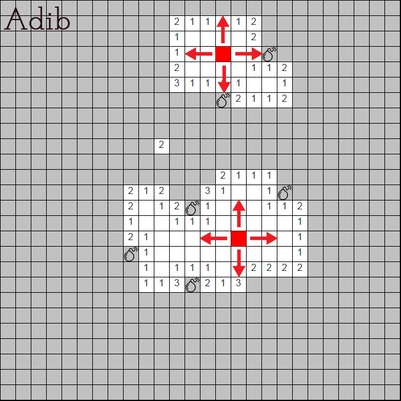

# Trapsweeper
### menu
* User can change the size.
* User can change the difficulty.
### Game 
* The hungry mouse wants to eat all the cheeses, but must watchout for the traps.
* Visual for win and lose.
* used sound for brtter user experience.
## Wireframe

## Main Function

## Framework

## Link to the game
https://adibfazli.github.io/Minesweeper/